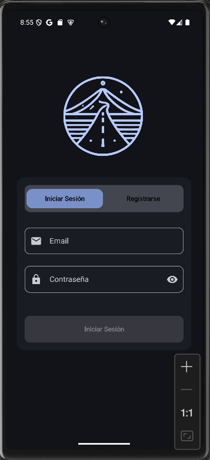
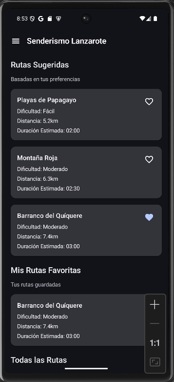
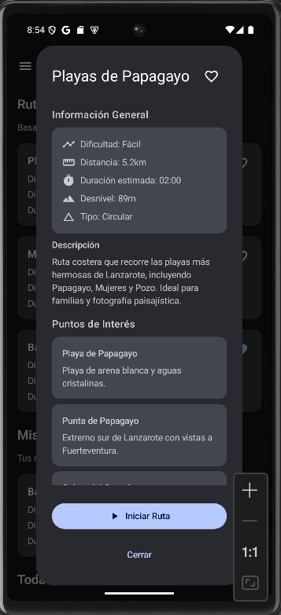
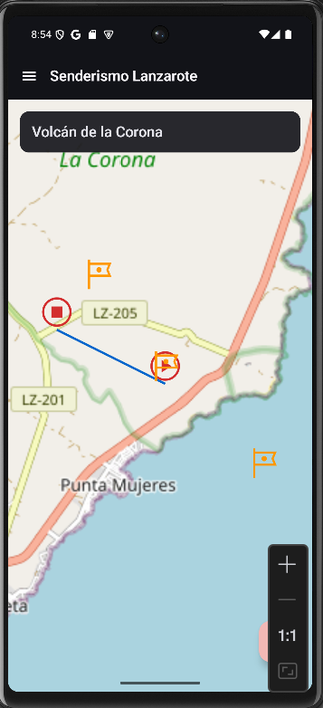
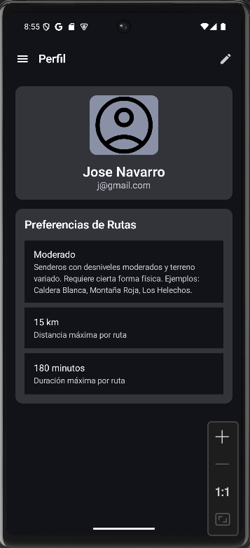
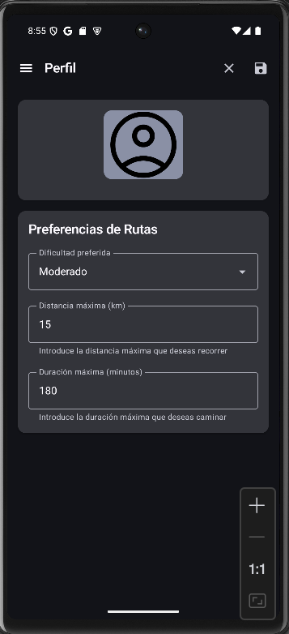

# Senderismo Lanzarote

Aplicación Android desarrollada como proyecto para la asignatura de Programación Multimedia y Dispositivos Móviles en IES Haría. La aplicación permite a los usuarios descubrir, seguir y guardar rutas de senderismo en Lanzarote, con información detallada sobre cada ruta y navegación asistida.

## Características

- Autenticación y gestión de usuarios
- Visualización de rutas en mapa interactivo con OSMDroid
- Información detallada de rutas (distancia, dificultad, tiempo estimado)
- Puntos de interés en cada ruta
- Sistema de rutas favoritas
- Preferencias personalizadas de rutas
- Navegación asistida durante el recorrido
- Interfaz moderna con Material Design 3

## Tecnologías Utilizadas

- **Lenguaje:** Kotlin
- **Arquitectura:** Clean Architecture + MVVM
- **Bibliotecas principales:**
  - Jetpack Compose para la interfaz de usuario
  - Room para persistencia de datos
  - Hilt para inyección de dependencias
  - OSMDroid para mapas y navegación
  - DataStore para preferencias
  - BCrypt para encriptación de contraseñas
  - Material 3 para el diseño
  - Corrutinas y Flow para operaciones asíncronas

## Estructura del Proyecto
Mi proyecto usa una arquitectura `Feature-Oriented Clean Architecture` organizada de la siguiente manera:
```
app/
├─ data/                 # Capa de datos
│  ├─ database/          # Base de datos Room, DAOs y entidades
│  ├─ datastore/         # Preferencias y estado de la aplicación
│  ├─ handler/           # Manejo de errores
│  ├─ logger/            # Sistema de logging
│  ├─ mapper/            # Conversión entre entidades y modelos
│  ├─ repository/        # Implementación de repositorios
├─ di/                   # Módulos de Hilt
├─ domain/               # Capa de dominio
│  ├─ model/            
│    ├─ auth/           # Modelos de autenticación
│    ├─ error/          # Modelos de error
│    ├─ map/            # Modelos de navegación y mapas
│    ├─ route/          # Modelos de rutas y puntos de interés
│    ├─ user/           # Modelos de usuario y preferencias
│  ├─ repository/       # Interfaces de repositorio
│  ├─ usecase/          # Casos de uso
├─ presentation/         # Capa de presentación
│  ├─ common/           # Componentes y recursos compartidos
│  ├─ core/             # Componentes base
│  ├─ features/         # Características principales
│    ├─ auth/           # Autenticación
│    ├─ home/           # Pantalla principal
│    ├─ navigation/     # Navegación en ruta
│    ├─ profile/        # Perfil de usuario
```
Esta estructura permite una separación clara de responsabilidades, facilita el mantenimiento y promueve la escalabilidad del proyecto. Además, utiliza principios como SOLID e inversión de dependencias (Hilt) para una arquitectura robusta y extensible.

## Características Principales

### Gestión de Usuarios
- Registro y autenticación de usuarios
- Perfiles personalizados
- Preferencias de rutas (dificultad, distancia, duración)

### Rutas
- Listado de rutas disponibles
- Información detallada (distancia, dificultad, elevación)
- Puntos de interés en cada ruta
- Sistema de rutas favoritas
- Filtrado según preferencias del usuario

### Navegación
- Visualización de ruta en mapa interactivo
- Tracking de posición del usuario
- Marcadores de puntos de interés
- Soporte para modo nocturno en mapas


## Capturas del proyecto
# Pantalla de Auth


# Pantalla de Home sin ruta activa


# Pantalla de Home: Información de ruta


# Pantalla de Home con ruta activa


# Pantalla de Profile


# Pantalla de Profile en modo edición



## Autor

Jose Antonio Navarro Perez
